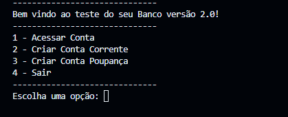
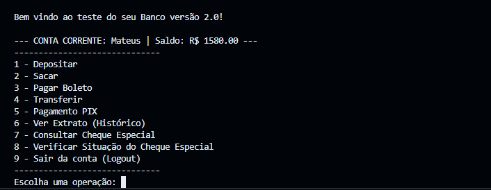

# 🏦 Sistema Bancário - POO em Java

> **Simulação de um banco digital via console, aplicando pilares da Programação Orientada a Objetos e Arquitetura em Camadas.**


## 📝 Sobre o Projeto

Este projeto foi desenvolvido durante o bootcamp **NTT DATA - Java e IA Para Iniciantes** da [DIO](https://www.dio.me/).

O objetivo principal foi evoluir um script simples para uma aplicação robusta, demonstrando na prática como a **Programação Orientada a Objetos (POO)** resolve problemas de organização, manutenção e escalabilidade de código.

A aplicação simula um terminal bancário onde é possível gerenciar contas (Corrente e Poupança), realizar transações financeiras e tirar extratos, tudo através de uma interface de console interativa.

### ✨ Funcionalidades Principais

* **Gestão de Contas:** Criação automática de contas e autenticação segura (Agência + Conta + CPF).
* **Operações Financeiras:**
    * **Depósitos & Saques:** Com validação de saldo.
    * **Transferências & PIX:** Movimentação entre contas.
    * **Pagamentos:** Simulação de pagamento de boletos.
* **Regras de Negócio:**
    * **Conta Corrente:** Possui Cheque Especial (limite extra).
    * **Conta Poupança:** Lógica de rendimento simulado.
* **Relatórios:** Extrato detalhado com histórico de transações e consulta de limites.

---

## 🏛️ Arquitetura e Conceitos de POO

Este projeto não é apenas sobre "fazer funcionar", mas sobre **como estruturar**. A arquitetura segue o fluxo: `View -> Service -> Repository -> Model`.

Os 4 pilares da POO foram aplicados intensivamente:

1.  **Herança:** A classe `Conta` é a base para `ContaCorrente` e `ContaPoupanca`, evitando repetição de código.
2.  **Polimorfismo:** O sistema trata as contas de forma genérica. O método `iniciarOperacoesMenu` se comporta de maneira diferente dependendo se o objeto é Corrente ou Poupança.
3.  **Encapsulamento:** Atributos protegidos (`private`/`protected`) garantem que o saldo só seja alterado por métodos oficiais (sacar/depositar), prevenindo inconsistências.
4.  **Abstração:** Classes e métodos abstratos definem um "contrato" que obriga as classes filhas a implementarem comportamentos específicos.

---

## 📸 Screenshots

*(Como é uma aplicação de console, os prints mostram a interação via terminal)*

|||
|:---:|:---:|
|**Menu Interativo**|**Extrato Detalhado**|

---

## 🛠️ Tecnologias Utilizadas

* **Linguagem:** Java 17 (LTS)
* **Paradigma:** Orientação a Objetos
* **Ferramentas:** Git & GitHub

---

## 🚀 Como Executar o Projeto

1.  **Clone o repositório:**
    ```bash
    git clone https://github.com/MateusLima909/Sistema-Bancario-Simples.git
    ```

2.  **Abra na sua IDE:**
    * Importe o projeto no IntelliJ, Eclipse ou VS Code.

3.  **Execute:**
    * Localize o arquivo `Main.java` e execute-o.
    * Siga as instruções no console para criar sua conta e realizar operações.

---

## 🗺️ Roadmap (Evolução)

O projeto está funcional, mas tenho planos para modernizar a stack técnica:

- [ ] **Refatoração:** Utilizar `Enums` para tipos de conta e `Records` para dados imutáveis.
- [ ] **Precisão:** Migrar valores monetários de `double` para `BigDecimal`.
- [ ] **Persistência:** Salvar dados em arquivo (JSON) ou banco de dados (H2/MySQL) para não perder as contas ao fechar.
- [ ] **API:** Transformar este projeto de console em uma **API REST com Spring Boot**.

---

## 📝 Autor

Desenvolvido por **[Mateus Lima](https://www.linkedin.com/in/mateuslima-santos)**.
